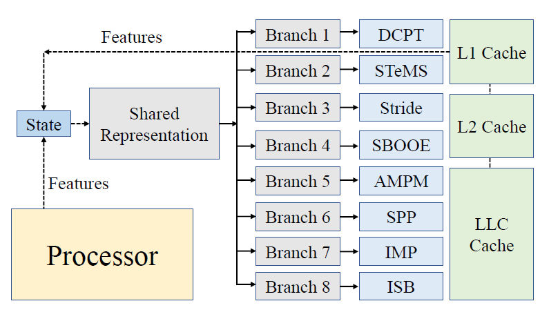
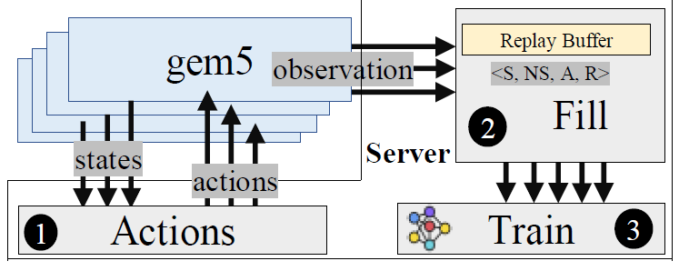

# Managing Prefetchers with Deep Reinforcement Learning

We aim to reduce contention caused by multiple aggressive prefetchers on shared resources (e.g., LLC and memory bandwidth) with a multi-agent reinforcement learning scheme. The agent finds what prefetchers to use and determines how aggressive they should be at any time during the execution.

# Goro

There is one shared network and one branch per prefetcher in the system. In our system, there are two prefetchers per L1, two prefetchers per L2, and three prefetchers in L3. We use features (hardware counters) to form the state of the system. We take features from both caches and cores. To determine the prefetcher’s configuration, we forward-propagate the state into the network and obtain the configuration of each prefetcher.

<p align="center">
  
</p>

# Platform
We extend gem5 to evaluate Goro. Figure below shows the overview of our platform. We run simulations in parallel and communicate states and actions to a single server process. The server has three threads running: (1) Thread Action: a thread that receives a state from any running simulation, performs inference, and returns the
action to the simulator; (2) Thread Fill: a thread that receives a tuple of < state;nextstate;action; reward > from any running simulation and inserts it to the Replay Buffer; and (3) Thread Train: a thread that at a reconfigurable interval picks a batch from the replay buffer and performs a typical deep learning training. The server uses PyTorch to implement the networks and performs the training.

In gem5, we devise a simple interface to read out any counters. The interface takes two inputs: (1) epoch length in terms of instruction counts; and (2) gem5 component and counter’s names that we are interested in reading (e.g., L1 miss rate). The interface then runs the simulation based on the action obtained from the Thread Action for the epoch length, stops the simulation when the epoch is finished, returns the counters to
the Thread Fill, and resumes the simulation with the new actions (a.k.a new prefetcher’s configuration). This loop continues until the simulation is over.

<p align="center">
  
</p>

## Citation

If you find this open-source release useful, please reference in your paper:

```
@inproceedings{jalili2022Goro,
  title={Managing Prefetchers with Deep Reinforcement Learning},
  author={Jalili, Majid and Erez, Mattan},
  year={2022}
}
```
